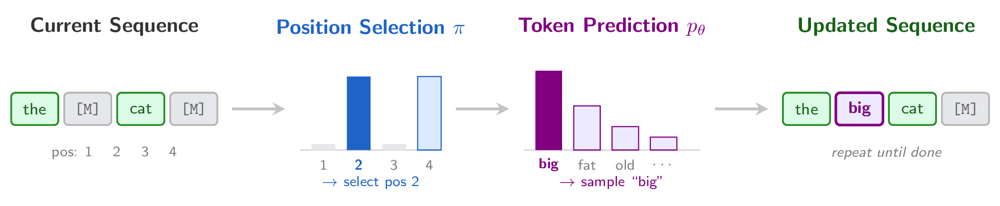

# [DUEL: Exact Likelihood for Masked Diffusion via Deterministic Unmasking](https://arxiv.org/abs/2603.01367)

By [Gilad Turok](https://giladturok.github.io), [Chris De Sa](https://www.cs.cornell.edu/~cdesa/), [Volodymyr Kuleshov](https://www.cs.cornell.edu/~kuleshov/)

[](https://arxiv.org/pdf/2603.01367)
[](https://arxiv.org/abs/2603.01367)
[](https://giladturok.github.io/duel/)

<p align="center">
  
</p>

We introduce **DUEL** ⚔️ (**D**eterministic **U**nmasking **E**xact **L**ikelihood), a framework for computing exact log-likelihoods under the test-time distribution of masked diffusion models (MDMs). By pairing a pretrained denoiser with a deterministic unmasking policy, DUEL collapses the super-exponentially large sum over unmasking orders to a single term, enabling exact (not bound) likelihood evaluation.

Key findings:
- DUEL narrows the MDM-to-autoregressive perplexity gap by up to 32% on in-domain data and 82% on zero-shot benchmarks
- Probability margin is the best-performing unmasking strategy under fixed compute budgets
- MDMs can even surpass autoregressive models with oracle unmasking orderings

## Code Organization

| File | Description |
|------|-------------|
| `main.py` | Entry point for all experiments |
| `diffusion.py` | Forward/reverse diffusion, training, sampling |
| `exact_likelihood.py` | DUEL exact log-likelihood computation |
| `selection_strategies.py` | Deterministic unmasking policies (greedy, L2R, prob. margin, conf. threshold) |
| `dataloader.py` | Data loading utilities |
| `metrics.py` | Evaluation metrics (perplexity, BPD, gen. perplexity, MAUVE) |
| `noise_schedule.py` | Noise schedules |
| `models/` | Network architectures (DiT, AR transformer) |
| `configs/` | Hydra configuration files |
| `scripts/` | Shell scripts for all experiments |
| `ntbks/` | Jupyter notebooks for figure generation |
| `large_scale/` | Separate subdirectory for the LLaDA-8B + Llama3-8B experiments (Table 5) — wraps `lm-eval-harness`. See [`large_scale/README.md`](large_scale/README.md). |

### Reproducing the paper

| Paper element | How to run | Output |
|---|---|---|
| Tables 4 / 6 (OWT NFE sweeps) | `sbatch scripts/sampler_comparison/duel_ppl.sh` (DUEL PPL), `sbatch scripts/sampler_comparison/sample_eval.sh` (Gen PPL) | `logs/`, `sample_logs/` |
| Table 5 (LLaDA-8B + Llama3-8B) | `cd large_scale && bash scripts/table5.sh` | `large_scale/outputs/table5/` |
| Table 7 (BD3-LM oracle on AG News) | `sbatch scripts/sampler_comparison/oracle_unmask.sh` | `logs/bd3lm_ag_news_block_size4_exact_ll_block_permutation.log` |
| Figures 4 / 5 (sampler comparison) | Re-execute `ntbks/fig__sampler_comparison.ipynb` after the above sweeps | inline in the notebook |

### Scripts Directory

Each perplexity directory contains scripts for all models (`bd3lm_elbo`, `bd3lm_duel`, `mdlm_elbo`, `mdlm_duel`, `sedd_elbo`, `sedd_duel`, `ar`). AR models support ELBO only.

| Directory / File | Experiment |
|------------------|------------|
| `scripts/owt_perplexity/` | OWT in-domain perplexity |
| `scripts/lm1b_perplexity/` | LM1B in-domain perplexity |
| `scripts/zeroshot_perplexity/` | Zero-shot perplexity |
| `scripts/sampler_comparison/duel_ppl.sh` | Sampler comparison via exact (DUEL) perplexity |
| `scripts/sampler_comparison/sample_eval.sh` | Sampler comparison via generative perplexity |
| `scripts/sampler_comparison/oracle_unmask.sh` | Oracle (block-permutation) unmasking on AG News (Table 7) |
| `scripts/log_sample_stats.py` | Aggregate generative perplexity results from `sample_logs/` |
| `scripts/run_all.sh` | Run all experiments end-to-end |
| `large_scale/scripts/table5.sh` | Table 5 reproduction (LLaDA + Llama3 on Wikitext / Lambada / AG News) |

## Getting Started

### Installation

```bash
conda env create -f environment.yml
conda activate duel
pip install -r requirements.txt
```

BD3-LMs and AR models don't require FlashAttention, but MDLM and SEDD baselines do. To install:
```bash
pip install flash-attn==2.5.6 --no-build-isolation
```
This requires CUDA toolkit and a compatible GPU (Ampere or newer). If installation fails, see the [flash-attn repo](https://github.com/Dao-AILab/flash-attention) for troubleshooting.

Create output directories:

```bash
mkdir -p outputs watch_folder logs sample_logs
```
- `outputs/` — Hydra run directories (configs, checkpoints)
- `watch_folder/` — SLURM stdout/stderr logs
- `logs/` — script output logs
- `sample_logs/` — generated text samples

### Quickstart notebook

For a from-scratch walkthrough of ELBO and DUEL perplexity on a single OWT example — bypassing `main.py` / Lightning / Hydra and rewriting the math by hand — see [`ntbks/example.ipynb`](ntbks/example.ipynb). It loads `kuleshov-group/mdlm-owt` directly from HuggingFace, implements the four unmasking strategies (`greedy`, `prob_margin`, `left_to_right`, `confidence_threshold`) as a `score × select` decomposition, and computes both perplexities side-by-side.

### Configuration

**Data paths:** Dataset cache directories are configured in `configs/data/*.yaml` via the `cache_dir` field. Update these to point to your local data directory.

**Checkpoint paths:** Some scripts reference local checkpoint paths (e.g., `/share/kuleshov/...`). For OWT models, HuggingFace model IDs are used and checkpoints download automatically. For LM1B models, update the `eval.checkpoint_path` in the relevant scripts to point to your local checkpoint files.

## Checkpoints

### OpenWebText

The following checkpoints download automatically from HuggingFace:

| Model | HuggingFace ID |
|-------|---------------|
| BD3-LM (L'=4) | `kuleshov-group/bd3lm-owt-block_size4` |
| BD3-LM (L'=8) | `kuleshov-group/bd3lm-owt-block_size8` |
| BD3-LM (L'=16) | `kuleshov-group/bd3lm-owt-block_size16` |
| MDLM | `kuleshov-group/mdlm-owt` |

The following must be downloaded manually from [Google Drive](https://drive.google.com/drive/folders/16LuuptK7Xfk-vzhQYZBZ0SA-B-BFluau?usp=sharing):

| Model |
|-------|
| AR (OWT) |
| SEDD (OWT) |

### LM1B

All LM1B checkpoints (BD3-LM, MDLM, SEDD, AR) must be downloaded manually from [Google Drive](https://drive.google.com/drive/folders/16LuuptK7Xfk-vzhQYZBZ0SA-B-BFluau?usp=sharing). After downloading, update `eval.checkpoint_path` in the relevant scripts under `scripts/lm1b_perplexity/`.

## Reproducing Experiments

The main entry point is `main.py` with three evaluation modes:
- `mode=duel_ppl` — DUEL exact perplexity
- `mode=elbo_ppl` — ELBO-based perplexity
- `mode=sample_eval` — Generative sampling + metrics

To run **all experiments** across all tables (including all block sizes and sampler configurations):
```bash
bash scripts/run_all.sh
```

Scripts are designed for SLURM (`sbatch`) but can be run directly with `bash`. For example:

```bash
# Instead of:
sbatch scripts/owt_perplexity/bd3lm_elbo.sh

# Run directly (inherits the active conda environment):
bash scripts/owt_perplexity/bd3lm_elbo.sh
```

**Adjusting batch size:** Edit `loader.eval_batch_size` inside the script to fit your GPU memory.

**Weights & Biases logging:** All scripts log to W&B project `duel` by default. To disable W&B, set `wandb=null` in the script.

### Table 1: In-Domain Perplexity (OWT)

**ELBO perplexity:**
```bash
bash scripts/owt_perplexity/bd3lm_elbo.sh  # BD3-LM (sweeps L'=4, 8, 16)
bash scripts/owt_perplexity/mdlm_elbo.sh
bash scripts/owt_perplexity/sedd_elbo.sh
```

**DUEL perplexity:**
```bash
bash scripts/owt_perplexity/bd3lm_duel.sh  # BD3-LM (sweeps L'=4, 8, 16)
bash scripts/owt_perplexity/mdlm_duel.sh
bash scripts/owt_perplexity/sedd_duel.sh
```

**AR perplexity:**
```bash
bash scripts/owt_perplexity/ar.sh
```

### Table 2: In-Domain Perplexity (LM1B)

Same structure as OWT. Update `eval.checkpoint_path` to your local LM1B checkpoint before running.

**ELBO perplexity:**
```bash
bash scripts/lm1b_perplexity/bd3lm_elbo.sh
bash scripts/lm1b_perplexity/mdlm_elbo.sh
bash scripts/lm1b_perplexity/sedd_elbo.sh
```

**DUEL perplexity:**
```bash
bash scripts/lm1b_perplexity/bd3lm_duel.sh
bash scripts/lm1b_perplexity/mdlm_duel.sh
bash scripts/lm1b_perplexity/sedd_duel.sh
```

**AR perplexity:**
```bash
bash scripts/lm1b_perplexity/ar.sh
```

### Table 3: Zero-Shot Perplexity

Evaluates on AG News, LAMBADA, PTB, WikiText-2, WikiText-103, PubMed, ArXiv, LM1B.

**ELBO perplexity:**
```bash
bash scripts/zeroshot_perplexity/bd3lm_elbo.sh
bash scripts/zeroshot_perplexity/mdlm_elbo.sh
bash scripts/zeroshot_perplexity/sedd_elbo.sh
```

**DUEL perplexity:**
```bash
bash scripts/zeroshot_perplexity/bd3lm_duel.sh
bash scripts/zeroshot_perplexity/mdlm_duel.sh
bash scripts/zeroshot_perplexity/sedd_duel.sh
```

**AR perplexity:**
```bash
bash scripts/zeroshot_perplexity/ar.sh
```

### Table 4 / Figures 4–5: Sampler Comparison (BD3-LM L'=16, OWT)

Each script sweeps all strategies and NFE budgets in a single job.

**DUEL perplexity under different unmasking strategies:**
```bash
bash scripts/sampler_comparison/duel_ppl.sh
```

**Generative perplexity under different unmasking strategies:**
```bash
bash scripts/sampler_comparison/sample_eval.sh
```

After `sample_eval.sh` completes, aggregate results from `sample_logs/`:
```bash
python scripts/log_sample_stats.py
```

### Acknowledgements

This repository was built off of [BD3-LMs](https://github.com/kuleshov-group/bd3lms), [MDLM](https://github.com/kuleshov-group/mdlm), and [SEDD](https://github.com/louaaron/Score-Entropy-Discrete-Diffusion).

## Citation

```bibtex
@article{turok2026duel,
  title={DUEL: Exact Likelihood for Masked Diffusion via Deterministic Unmasking},
  author={Turok, Gilad and De Sa, Chris and Kuleshov, Volodymyr},
  journal={arXiv preprint arXiv:2603.01367},
  year={2026}
}
```
